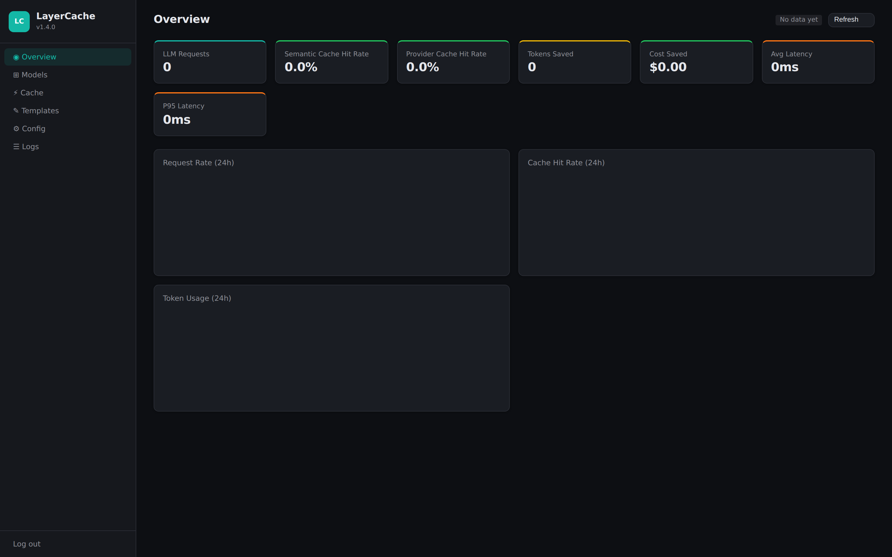
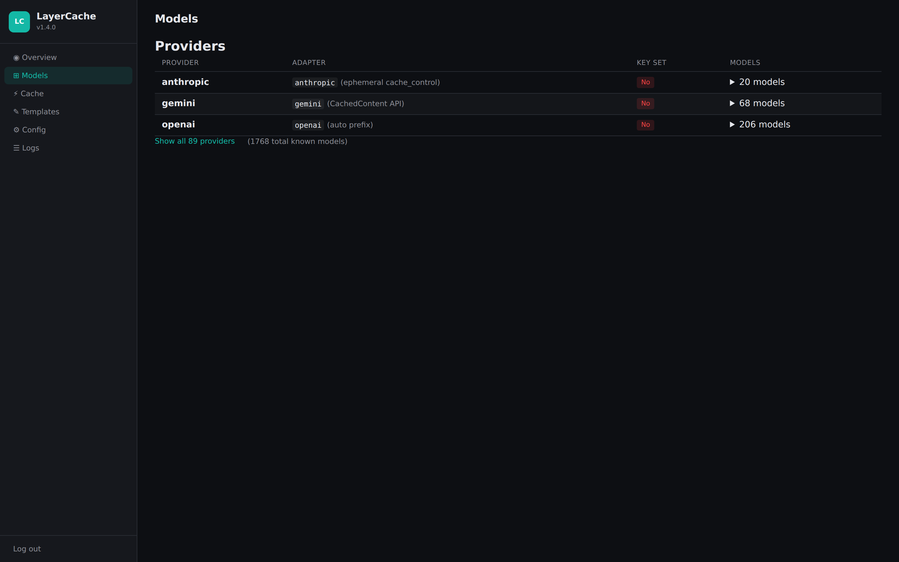
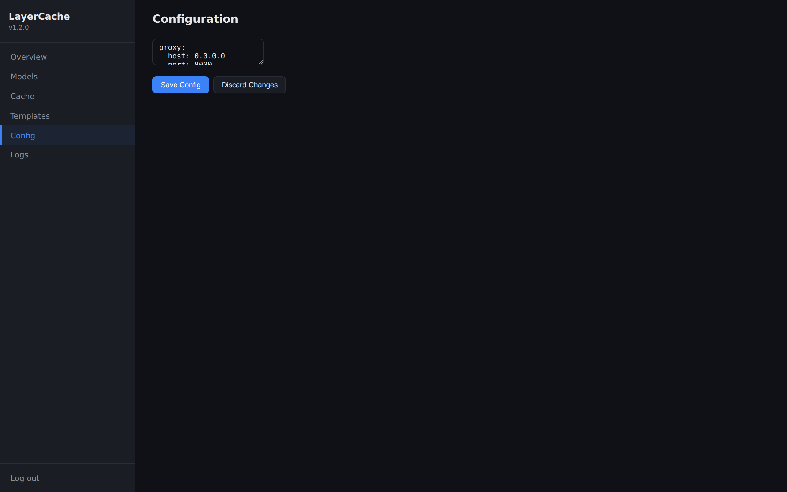

<p align="center">
  
  
  
  
  
</p>

<h1 align="center">LayerCache</h1>

<p align="center">
  <strong>Intelligent Prompt Enhancement & Token Caching Proxy</strong><br>
  A self-hosted, provider-agnostic LLM proxy that cuts costs by 30-60% and latency by 40%+ through aggressive token caching and cache-safe prompt engineering.
</p>

---

## Table of Contents

- [Overview](#overview)
- [Why LayerCache?](#why-layercache)
- [Core Concept: The Layered Prompt Architecture](#core-concept-the-layered-prompt-architecture)
- [Features](#features)
- [Quick Start](#quick-start)
- [Usage Examples](#usage-examples)
- [API Reference](#api-reference)
- [Configuration](#configuration)
- [Docker Deployment](#docker-deployment)
- [Architecture](#architecture)
- [Development](#development)
- [Documentation](#documentation)
- [License](#license)

---

## Overview

LayerCache sits between your application and LLM providers (Anthropic, OpenAI, Google Gemini). It is a **drop-in replacement** for your LLM provider's base URL — just point your OpenAI SDK at LayerCache.

In the background, LayerCache:

1. **Canonicalizes** your prompts for byte-for-byte deterministic output (maximizing prefix cache hits)
2. **Injects provider-specific cache markers** at stable layer boundaries
3. **Truncates long conversations** to fit within a token budget (keeping recent turns, dropping old ones)
4. **Warns when your prefix is too short** for provider caching to work
5. **Applies prompt enhancements** (Chain of Thought, few-shot examples, etc.) *without breaking the cache*
6. **Caches semantically similar queries** to bypass the LLM entirely on repeat requests
7. **Tracks metrics** — token savings, cost reduction, cache hit rates — via Prometheus and a built-in web dashboard

## Why LayerCache?

| Problem | LayerCache Solution |
|---------|---------------------|
| Prompt prefix cache misses due to whitespace/ordering differences | Automatic canonicalization ensures identical prompts produce byte-for-byte identical output |
| Adding prompt enhancements (CoT, few-shots) breaks provider caching | Layered architecture (L0-L4) ensures enhancements are injected *after* the cached prefix |
| No visibility into cache performance or cost savings | Built-in Prometheus metrics and JSON dashboard showing hit rates, tokens saved, and $ saved |
| Different providers have different caching mechanisms | Provider adapters handle Anthropic (ephemeral markers), OpenAI (auto-caching), and Gemini (CachedContent) |
| Repeated similar queries waste tokens and money | Semantic cache with embedding similarity matching bypasses the LLM for near-duplicate queries |
| Long conversations grow an unbounded prefix, reducing cache effectiveness | Automatic L2 session truncation keeps only the last N tokens of conversation history |
| Silent cache misses with no diagnostic | Runtime warning when L0+L1+L2 is below the provider caching threshold (~1024 tokens) |
| Cross-conversation semantic cache hits near zero due to session history in the cache key | Prefix hash redesigned to L0+L1 only — L2 and session_id excluded from the cache key |
| Model names differ between client config and upstream API | Configurable model aliases + automatic upstream model discovery |

## Core Concept: The Layered Prompt Architecture

The key insight behind LayerCache is that prompts have **naturally occurring layers** with different stability profiles. By enforcing strict separation between these layers, we can optimize caching and enhance prompts without invalidating provider prefix caches.

| Layer | Content | Mutability | Cache Status |
|-------|---------|------------|--------------|
| **L0: System** | Core persona, safety rules, output format | Immutable | **Cached** |
| **L1: Context** | Domain knowledge, tool definitions, static few-shots | Updated rarely | **Cached** |
| **L2: Session** | Conversation history, user preferences | Per session/turn | **Cached** (short TTL) |
| **L3: Enhancement** | Dynamic instructions (CoT, RAG, dynamic few-shots) | Per request | **Uncached** |
| **L4: User Input** | The actual user query | Dynamic | **Uncached** |

Cache breakpoints are placed at L0/L1/L2 boundaries. Enhancements are injected at L3, ensuring they never invalidate the stable prefix.

### Cache Optimization
- **Prompt Canonicalizer** — Whitespace normalization, JSON minification, tool sorting for byte-for-byte deterministic output
- **Layered Architecture (L0-L4)** — Separates system, context, session, enhancement, and user content so enhancements never invalidate the cached prefix
- **Provider Cache Markers** — Anthropic `cache_control`, OpenAI auto-prefix caching, Gemini `CachedContent`
- **Injection at Stable Layers** — Markers placed at L0/L1/L2 boundaries; L3/L4 left uncached

### Session Management
- **Smart Truncation** — Automatically drop old conversation turns to fit within token budgets (`recent` or `important` strategies)
- **Prefix Threshold Diagnostics** — Info-level warning when L0+L1+L2 is below the ~1024-token caching threshold

### Semantic Cache
- **Dual Backend Support** — SQLite (dev) or Redis (production) with automatic fallback
- **Local Embeddings** — FastEmbed (BAAI/bge-small-en-v1.5) in ProcessPoolExecutor
- **Dual-Key Strategy** — Prefix hash (exact) + query embedding (semantic similarity)
- **Session Isolation** — Prevent cross-session cache pollution with automatic session ID management
- **Configurable TTLs** — Per-request and default TTLs with automatic cleanup

### Prompt Enhancements
- **Enhancement API** — Composable prompt engineering via request metadata
- **Suffix Injection** — Enhancements injected at L3, never breaking L0-L2 cache
- **Dynamic Few-Shot Selector** — Embedding-based retrieval of relevant examples
- **Prompt Registry** — Named, versioned prompt templates (YAML/JSON)

### Observability & Management
- **Analytics Dashboard** — Interactive charts for cache hit rates, token savings, latency trends, and cost tracking
- **Prometheus + JSON Metrics** — Token savings, cost reduction, cache hit rates
- **Web Dashboard** — Overview charts, per-model breakdown, cache browser, config editor, live log viewer (Jinja2 + HTMX + Chart.js)
- **Persistent Time-Series** — Metric snapshots in SQLite with background collection loop
- **Config Hot-Reload** — Update log level, pipeline timeout/retries at runtime without restart
- **Universal Routing** — LiteLLM-based multi-provider routing with automatic failover

## Quick Start

### Option 1: Docker (Recommended)

```bash
# Clone the repository
git clone https://github.com/ZeroClue/layercache.git
cd layercache

# Set your API keys
export ANTHROPIC_API_KEY=sk-ant-...
export OPENAI_API_KEY=sk-...

# For Redis backend (production):
# export LAYERCACHE_REDIS_URL=redis://localhost:6379/0

# Start the proxy
docker-compose up -d
```

### Option 2: pip install

```bash
# Install dependencies
pip install -r requirements.txt

# Set environment variables
export ANTHROPIC_API_KEY=your-key
export OPENAI_API_KEY=your-key

# Run the proxy
uvicorn layercache.main:app --host 0.0.0.0 --port 8000
```

### Verify it works

```bash
curl http://localhost:8000/health
# {"status":"healthy","version":"1.5.0","semantic_cache":true}
```

Open [http://localhost:8000/dashboard](http://localhost:8000/dashboard) for the web dashboard (config editor, metrics charts, logs, template CRUD).

<p align="center">
  
  <br>
  <em>Dashboard overview with live metrics</em>
</p>

<p align="center">
  
  <br>
  <em>Per-model breakdown with adapter column</em>
</p>

<p align="center">
  
  <br>
  <em>In-browser config editor</em>
</p>

## Usage Examples

### Basic Proxy (Zero Configuration)

Just point your existing OpenAI client at LayerCache. No code changes needed — caching works automatically.

```python
from openai import OpenAI

client = OpenAI(
    base_url="http://localhost:8000/v1",
    api_key="sk-ant-your-anthropic-key"  # Provider key passed through
)

response = client.chat.completions.create(
    model="anthropic/claude-3-5-sonnet-20241022",
    messages=[
        {"role": "system", "content": "You are a helpful assistant."},
        {"role": "user", "content": "Explain async/await in Python."}
    ]
)
```

### With Cache-Safe Enhancements

Add Chain of Thought reasoning without breaking the cache prefix:

```python
response = client.chat.completions.create(
    model="anthropic/claude-3-5-sonnet-20241022",
    messages=[
        {"role": "system", "content": "You are a helpful assistant."},
        {"role": "user", "content": "What is the time complexity of quicksort?"}
    ],
    extra_body={
        "lc_enhancements": ["chain_of_thought"]
    }
)
```

### Using a Prompt Template

Reference a named template from the registry instead of sending L0/L1 with every request:

```python
response = client.chat.completions.create(
    model="anthropic/claude-3-5-sonnet-20241022",
    messages=[
        {"role": "user", "content": "Review this code for bugs."}
    ],
    extra_body={
        "lc_template": "code-assistant"
    }
)
```

### Controlling Semantic Cache

```python
# Skip semantic cache for this request
response = client.chat.completions.create(
    model="gpt-4o",
    messages=[...],
    extra_body={
        "lc_cache_ttl": 0,           # No semantic caching
        "lc_enhancements": ["self_critique"]
    }
)

# Custom TTL (10 minutes)
response = client.chat.completions.create(
    model="gpt-4o",
    messages=[...],
    extra_body={
        "lc_cache_ttl": 600
    }
)
```

### Checking Cache Performance

```bash
# JSON dashboard
curl http://localhost:8000/v1/cache/metrics

# Prometheus metrics
curl http://localhost:8000/metrics
```

## API Reference

### OpenAI-Compatible Endpoints

| Method | Endpoint | Description |
|--------|----------|-------------|
| `POST` | `/v1/chat/completions` | Chat completions (drop-in OpenAI replacement) |
| `POST` | `/v1/messages` | Anthropic Messages API (drop-in Claude Code replacement) |
| `GET` | `/v1/models` | List available models |

### Management Endpoints

| Method | Endpoint | Description |
|--------|----------|-------------|
| `GET` | `/health` | Health check |
| `GET` | `/v1/cache/metrics` | Cache performance metrics (JSON) |
| `GET` | `/v1/cache/metrics/history` | Bucketed time-series for charting |
| `GET` | `/v1/cache/metrics/status` | Snapshot age tracking |
| `GET` | `/metrics` | Prometheus metrics (text/plain) |
| `GET` | `/v1/prompts/templates` | List prompt templates |
| `POST` | `/v1/prompts/templates` | Create/update a template |
| `DELETE` | `/v1/prompts/templates/{name}` | Delete a template |
| `POST` | `/v1/prompts/reload` | Reload templates from disk |

### Dashboard Endpoints

| Method | Endpoint | Description |
|--------|----------|-------------|
| `GET` | `/dashboard` | Overview with stat cards + charts |
| `GET` | `/dashboard/models` | Provider/model table |
| `GET` | `/dashboard/cache` | Semantic cache stats + invalidation |
| `GET` | `/dashboard/templates` | Prompt template CRUD |
| `GET` | `/dashboard/config` | YAML config editor |
| `POST` | `/dashboard/config/save` | Save config (HTMX, CSRF-protected) |
| `GET` | `/dashboard/logs` | Log tail from ring buffer |
| `GET` | `/dashboard/login` | Login form (when proxy key is set) |
| `POST` | `/dashboard/login` | Login action |

### LayerCache Request Extensions

These fields can be added to any `POST /v1/chat/completions` request:

| Field | Type | Default | Description |
|-------|------|---------|-------------|
| `lc_template` | `string` | `null` | Name of a prompt template to use for L0/L1 |
| `lc_enhancements` | `string[]` | `[]` | Enhancement names to apply at L3 |
| `lc_cache_ttl` | `int` | `300` | Semantic cache TTL in seconds (0 = skip) |
| `lc_layer_hints` | `object` | `null` | Explicit `index -> layer` mapping |
| `lc_skip_semantic_cache` | `bool` | `false` | Skip semantic cache lookup entirely |
| `lc_bypass_cache` | `bool` | `false` | Skip all caching (semantic + provider) |

### Built-in Enhancements

| Name | Description |
|------|-------------|
| `chain_of_thought` | Instructs the LLM to reason step-by-step |
| `structured_json` | Enforces JSON output format (optional schema) |
| `self_critique` | Instructs the LLM to review and refine its own response |
| `dynamic_few_shot` | Retrieves relevant few-shot examples from a local vector store |

## Configuration

All configuration is done via `layercache.yaml`. A [JSON Schema](layercache.schema.json) is provided for IDE autocompletion (VS Code, PyCharm). Regenerate it with `layercache-schema`:

```yaml
# yaml-language-server: $schema=./layercache.schema.json
proxy:
  host: 0.0.0.0
  port: 8000
  proxy_api_key: "your-optional-proxy-secret"  # Protect the proxy itself

providers:
  anthropic:
    api_key_env: ANTHROPIC_API_KEY        # Env var holding the key
  openai:
    api_key_env: OPENAI_API_KEY
  gemini:
    api_key_env: GOOGLE_API_KEY
  deepseek:
    api_key_env: DEEPSEEK_API_KEY          # Any LiteLLM provider works
    # adapter: openai                      # Override cache strategy (auto-detected if unset)
  opencode-go:
    api_key_env: OPENCODE_ZEN_API_KEY
    base_url: https://opencode.ai/zen/go/v1
    # No model_aliases needed — Go models use the same names client sends

caching:
  semantic:
    enabled: true
    backend: "sqlite"               # or "redis" for production
    db_path: /data/semantic_cache.db
    redis_url: "redis://localhost:6379/0"  # Redis backend URL (optional)
    redis_pool_size: 20             # Redis connection pool size
    default_ttl: 300                # 5 minutes
    similarity_threshold: 0.95      # Cosine similarity for semantic cache
    embedder: "BAAI/bge-small-en-v1.5"
    session_id_header: X-Session-ID  # Header for opt-in session isolation
  max_session_tokens: 2000          # Optional: truncate L2 to keep within token budget
  prefix_hash_max_tokens: 250       # Max L0 tokens for cache key (excludes per-project context)
  truncation_strategy: "recent"     # or "important" (score-based)
  metrics:
    db_path: /data/metrics.db       # Time-series snapshot storage
    snapshot_interval_seconds: 60   # Background snapshot interval
    snapshot_retention_days: 7      # Snapshot retention

enhancements:
  registered:
    - name: chain_of_thought
    - name: structured_json
    - name: self_critique
    - name: dynamic_few_shot
      config:
        vector_store: /data/few_shots/examples.json
        top_k: 3
```

### Model Aliases

When a proxy sits between the client and the upstream API, model names sent by the client may differ from the names the upstream accepts. LayerCache supports two resolution mechanisms:

1. **Explicit aliases** (`model_aliases` in `ProviderConfig`): Maps a client-side model name to an upstream name. Use this when an upstream renames or versions a model (e.g., `qwen3.5-plus → qwen-3.5-plus-v2`).
2. **Auto-discovery**: On startup, LayerCache fetches `GET /v1/models` from each configured provider's `base_url` and builds a reverse index. If a requested model name isn't in the upstream list but matches a single ID by prefix (e.g., `deepseek-v4-flash` matches `deepseek-v4-flash-free` on Zen), it resolves automatically.

Auto-discovery only matches the **same model** — it does not redirect to a different product. `deepseek-v4-flash` (paid, Zero Retention on Go) and `deepseek-v4-flash-free` (free, data-collecting on Zen) are different models with different privacy guarantees; auto-discovery would not map between them for a subscription-based provider.

```yaml
providers:
  opencode:
    api_key_env: OPENCODE_ZEN_API_KEY
    base_url: https://opencode.ai/zen/v1
    model_aliases:
      my-custom-model-name: qwen3.5-plus
```

Auto-discovery requires `api_key_env` to be set so the model list endpoint can be authenticated. If both an explicit alias and an auto-discovered match exist, the explicit alias takes precedence.

### Claude Code Setup

LayerCache supports Claude Code (Anthropic CLI v2.1.145+) through the `/v1/messages` endpoint for both Claude Pro subscriptions and Ollama Cloud.

**Claude Pro via Anthropic API:**

Set `ANTHROPIC_BASE_URL=http://127.0.0.1:8000` and Claude Code routes all requests through LayerCache:
- No message translation needed — native Anthropic format
- Supports OAuth tokens (Claude Pro/Max subscriptions) and API keys
- Forwards context management headers automatically
- Tool calls work correctly (no double-translation)

**Ollama Cloud via Claude Code:**

```bash
export ANTHROPIC_API_KEY=your-ollama-cloud-api-key
```

Add the provider to `layercache.yaml`:

```yaml
providers:
  ollama-cloud:
    api_key_env: OLLAMA_API_KEY
    base_url: https://ollama.com/v1
```

Model names with the `:cloud` suffix (e.g. `deepseek-v4-flash:cloud`) are automatically detected and routed to Ollama Cloud with the suffix stripped before the upstream call.

### Environment Variables

| Variable | Description | Required |
|----------|-------------|----------|
| `ANTHROPIC_API_KEY` | Anthropic API key | If using Anthropic |
| `OPENAI_API_KEY` | OpenAI API key | If using OpenAI |
| `GOOGLE_API_KEY` | Google Gemini API key | If using Gemini |
| (custom) | Any env var name per `providers.{name}.api_key_env` in config | Depends on config |

## Docker Deployment

```bash
# Build and start
docker-compose up -d

# View logs
docker-compose logs -f layercache

# Stop
docker-compose down
```

### Docker Volumes

| Host Path | Container Path | Purpose |
|-----------|---------------|---------|
| `./data` | `/data` | Persistent storage (cache DB, templates, examples) |
| `./layercache.yaml` | `/app/layercache.yaml` | Configuration file (read-only) |

## Architecture

```
Client Application
        │
        ▼
┌──────────────────────────────────────┐
│          LayerCache Proxy            │
│  ┌────────────────────────────────┐  │
│  │     Request Pipeline           │  │
│  │  1. Semantic Cache Lookup     │  │
│  │  2. Stratify (L0→L4)          │  │
│  │  3. Canonicalize              │  │
│  │  3b. Truncate Session        │  │
│  │  3c. Prefix Threshold Check  │  │
│  │  4. Enhance (L3 injection)    │  │
│  │  5. Inject Cache Markers      │  │
│  │  6. Route via LiteLLM         │  │
│  │  7. Handle Response           │  │
│  │  8. Store & Record Metrics    │  │
│  └────────────────────────────────┘  │
│                                      │
│  ┌──────────┐ ┌────────┐ ┌────────┐ │
│  │ Semantic │ │ Prompt │ │Metrics │ │
│  │  Cache   │ │Registry│ │Collector│ │
│  └──────────┘ └────────┘ └────────┘ │
└──────────────────────────────────────┘
        │         │         │
        ▼         ▼         ▼
   Anthropic   OpenAI    Gemini
```

## Development

### Prerequisites

- Python 3.11+
- pip

### Setup

```bash
# Create virtual environment
python -m venv .venv
source .venv/bin/activate

# Install with dev dependencies
pip install -e ".[dev]"

# Run tests
pytest tests/ -v

# Run with coverage
pytest tests/ --cov=layercache --cov-report=term-missing
```

### Running Tests

```bash
# All tests
pytest tests/ -v

# Specific test file
pytest tests/test_stratifier.py -v

# With verbose output
pytest tests/ -v --tb=short
```

### Code Quality

```bash
# Lint and format
ruff check layercache/
ruff format layercache/

# Type checking
mypy layercache/
```

### Project Structure

```
layercache/
├── layercache/                   # Core package
│   ├── main.py                   # FastAPI application
│   ├── pipeline.py               # Request processing pipeline
│   ├── models.py                 # Pydantic data models
│   ├── stratifier.py             # L0-L4 message classification
│   ├── canonicalizer.py          # Prompt normalization
│   ├── config.py                 # YAML configuration
│   ├── schema.py                 # JSON Schema generator for IDE autocompletion
│   ├── adapters/                 # Provider cache marker injection
│   │   ├── anthropic.py         # Anthropic cache_control
│   │   ├── anthropic_messages.py # /v1/messages wire-format shim
│   │   ├── openai.py             # OpenAI auto-caching
│   │   └── gemini.py             # Gemini CachedContent
│   ├── enhancements/             # Cache-safe prompt enhancements
│   │   ├── base.py               # BaseEnhancement ABC
│   │   ├── chain_of_thought.py   # Step-by-step reasoning
│   │   ├── structured_output.py  # JSON format enforcement
│   │   ├── self_critique.py      # Self-review injection
│   │   └── dynamic_few_shot.py   # Vector-based example retrieval
│   ├── cache/                    # Semantic caching
│   │   ├── semantic.py           # SQLite-backed cache
│   │   └── embedder.py           # FastEmbed wrapper
│   ├── dashboard/                # Web dashboard (Jinja2 + HTMX)
│   │   ├── router.py             # Dashboard routes
│   │   └── templates/            # Jinja2 templates
│   ├── metrics/                  # Observability
│   │   ├── collector.py          # Prometheus + ROI tracking
│   │   └── storage.py            # Persistent time-series snapshots
│   ├── static/                   # Dashboard assets
│   └── registry/                 # Prompt template management
│       └── prompt_registry.py    # YAML/JSON template loader
├── tests/                        # Test suite (117 tests)
├── data/                         # Sample data
│   ├── prompts/                  # Prompt templates
│   └── few_shots/                # Few-shot examples
├── docs/                         # Documentation
│   ├── PRD.md                    # Product Requirements
│   ├── TDD.md                    # Technical Design
│   ├── IMPLEMENTATION_PLAN.md    # Sprint plan
│   ├── ARCHITECTURE.md           # Architecture deep-dive
│   ├── DEPLOYMENT.md             # Deployment guide
│   ├── USER_GUIDE.md             # User guide
│   └── API.md                    # API reference
├── Dockerfile                    # Production image
├── docker-compose.yml            # Docker Compose config
├── layercache.yaml               # Default configuration
├── pyproject.toml                # Python project config
├── layercache.schema.json        # JSON Schema for IDE autocompletion
└── requirements.txt              # Dependencies
```

## Documentation

### Core Documentation
| Document | Description |
|----------|-------------|
| [PRD](docs/PRD.md) | Product Requirements Document |
| [TDD](docs/TDD.md) | Technical Design Document |
| [Implementation Plan](docs/IMPLEMENTATION_PLAN.md) | 8-sprint development roadmap |
| [Architecture](docs/ARCHITECTURE.md) | System architecture deep-dive |
| [Roadmap](docs/ROADMAP.md) | Prioritized future development plan |
| [Deployment Guide](docs/DEPLOYMENT.md) | Production deployment instructions |
| [User Guide](docs/USER_GUIDE.md) | Comprehensive usage guide |
| [API Reference](docs/API.md) | Full API documentation |
| [Contributing](CONTRIBUTING.md) | How to contribute, setup, and PR process |
| [CHANGELOG](CHANGELOG.md) | Version history and changes |

### v1.5.0 Guides
| Document | Description |
|----------|-------------|
| [Redis Setup](docs/redis-setup.md) | Production Redis configuration and tuning |
| [Migration Guide](docs/migration-sqlite-to-redis.md) | Zero-downtime migration from SQLite to Redis |
| [Load Test Report](docs/load-test-report.md) | Performance benchmarks and throughput analysis |

## License

Built with [OpenCode Go](https://opencode.ai/go?ref=JAFCG08A7T) — fork, automate, ship.

This project is licensed under the **MIT License**. See [LICENSE](LICENSE) for the full text.

**What this means:**
- ✅ You can freely use, copy, modify, and distribute this software
- ✅ You can use it for commercial and private purposes
- ✅ You must include a copy of the license and copyright notice
- ⚠️  The software is provided "as-is" without warranty

**Third-party code**: Vendored libraries (Chart.js, HTMX) are included under their own licenses in [THIRD_PARTY_NOTICES.md](THIRD_PARTY_NOTICES.md).

For more information, visit https://opensource.org/licenses/MIT
