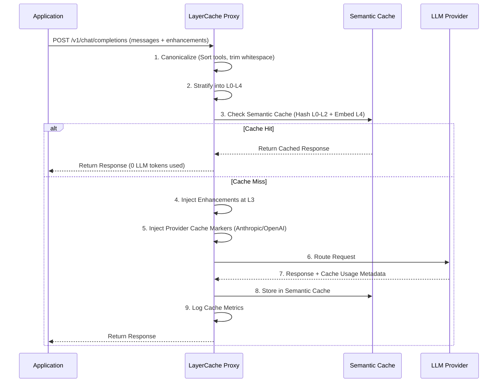

# Product Requirements Document (PRD)
## Project: LayerCache (Working Title)
### Intelligent Prompt Enhancement & Token Caching Proxy

**Version:** 1.0 | **Status:** Draft | **Date:** October 2023

---

## 1. Executive Summary

LayerCache is a self-hosted, provider-agnostic LLM proxy that combines the routing capabilities of LiteLLM with intelligent prompt optimization and token caching. It solves the fundamental tension between prompt enhancement (which rewrites prompts) and token caching (which requires prefix stability) by enforcing a **Layered Prompt Architecture**. The proxy transparently canonicalizes requests, injects provider-specific cache markers, and applies cache-safe enhancements, reducing LLM costs by 30-60% and latency by 40%+ for production workloads.

## 2. Problem Statement

1. **Cache Fragility:** Minor differences in whitespace, message ordering, or dynamic context cause prompt prefix cache misses (Anthropic, OpenAI, Gemini), wasting thousands of tokens per request.
2. **The Enhancement vs. Cache Tension:** Dynamically adding prompt enhancements (e.g., Chain of Thought, dynamic few-shots) alters the prompt prefix, negating the benefits of token caching.
3. **Fragmented Tooling:** Teams use one tool for routing (LiteLLM), custom scripts for prompt formatting, and manual trial-and-error for cache optimization. There is no unified system to manage prompt structure, enhancement, and cache performance.

## 3. Product Vision & Value Prop

**Vision:** A proxy that treats prompts as structured, cacheable data objects rather than raw strings.

**Value Proposition:** Drop-in proxy replacement that immediately cuts costs and latency via aggressive token caching, while offering a composable library of prompt enhancements that *do not break* the cache.

---

## 4. Core Concept: The Layered Prompt Architecture

To ensure enhancement never breaks caching, LayerCache enforces a strict top-down prompt structure. Cache breakpoints are only set at the boundaries of stable layers.

| Layer | Content | Mutability | Cache Status |
|-------|---------|------------|--------------|
| **L0: System** | Core persona, safety rules, output format | Immutable | **Cached** |
| **L1: Context** | Domain knowledge, tool definitions, static few-shots | Updated rarely (daily/weekly) | **Cached** |
| **L2: Session** | Conversation history, user preferences | Updated per session/turn | **Cached** (short TTL) |
| **L3: Enhancement** | Dynamic instructions (CoT, RAG, dynamic few-shots) | Updated per request | **Uncached** |
| **L4: User Input** | The actual user query | Dynamic | **Uncached** |

---

## 5. Functional Requirements

### 5.1 Phase 1: Cache Optimizer & Routing (MVP)
*The goal is zero-change integration that immediately improves cache hit rates.*

*   **R1.1 Prompt Canonicalizer:** Automatically reformat incoming prompt payloads into a deterministic, cache-friendly order.
    *   Sort JSON schemas/tool definitions alphabetically by name.
    *   Normalize whitespace and remove trailing/leading spaces from message content.
    *   Stratify messages into the L0-L4 layers.
*   **R1.2 Provider Cache Marker Injector:** Automatically inject provider-specific cache controls based on the detected L0-L2 boundaries.
    *   Anthropic: Inject `"cache_control": {"type": "ephemeral"}` at L0, L1, and L2 boundaries.
    *   OpenAI: Ensure L0-L2 is pushed as an unbroken prefix (automatic caching).
    *   Google Gemini: Automatically construct and reference `CachedContext` objects for L0/L1.
*   **R1.3 Universal Routing:** LiteLLM-compatible routing layer supporting OpenAI, Anthropic, and Google APIs with automatic failover.
*   **R1.4 Cache Observability Dashboard:** Expose metrics (`/metrics` endpoint) to track:
    *   Token Cache Hit Rate (% of input tokens read from cache).
    *   Estimated $ saved.
    *   Cache miss reasons (e.g., "Prefix changed at L1").

### 5.2 Phase 2: Cache-Safe Enhancer
*The goal is composable prompt improvement without cache invalidation.*

*   **R2.1 Enhancement API:** Accept enhancement directives via API metadata (e.g., `x-layer-enhancements: ["chain_of_thought", "structured_json"]`).
*   **R2.2 Suffix Injection:** Enhancements are *never* prepended or injected into L0-L2. They are compiled into a single block and inserted at L3 (between session history and the user query).
*   **R2.3 Dynamic Few-Shot Selector:** Given an embedding of the user query (L4), retrieve the top-K most relevant examples from a local vector store and inject them at L3.
*   **R2.4 Prompt Registry:** Store named, versioned prompt templates (L0 & L1) in the proxy. Clients call `POST /v1/chat/completions` with `x-template: code-review-v2`, and the proxy assembles the stable prefix itself, guaranteeing 100% prefix match.

### 5.3 Phase 3: Semantic Cache
*The goal is to bypass the LLM entirely for similar queries.*

*   **R3.1 Embedding Generation:** Intercept incoming L4 queries, generate a lightweight local embedding.
*   **R3.2 Similarity Match:** If similarity score > threshold (e.g., 0.95) against past L4 queries with identical L0-L2 hashes, return the cached LLM response immediately.
*   **R3.3 TTL & Invalidation:** Configurable TTLs for semantic cache entries.

---

## 6. Architecture & Data Flow

---

## 7. Provider-Specific Implementation Details

| Provider | Min Cached Tokens | Cache TTL | Implementation Detail in LayerCache |
|-----------|-------------------|-----------|-------------------------------------|
| **Anthropic** | 1024 | 5 min (extends on hit) | Inject `"cache_control": {"type": "ephemeral"}` on the last content block of L0, L1, and L2. |
| **OpenAI** | 1024 | Auto | OpenAI caches automatically. LayerCache's job is purely Canonicalization (ensuring L0-L2 is identical byte-for-byte). |
| **Gemini** | Configurable | 1min - Hours | LayerCache will explicitly create a `CachedContext` via the Gemini API for L0-L1, and reference the cache ID in subsequent calls. |

---

## 8. Technical Specifications

*   **Language/Framework:** Python (FastAPI) or Rust (Actix-Web/Axum). *Recommendation: Python for ecosystem (LiteLLM, LangChain, sentence-transformers), Rust for ultra-low latency.*
*   **Deployment:** Docker container. Drop-in replacement for `openai` base URL.
*   **Storage:**
    *   Semantic Cache: Local SQLite + `sqlite-vss` or Redis + RedisVL.
    *   Prompt Registry: YAML/JSON files mounted in container or Git-synced.
    *   Metrics: Prometheus exporter.
*   **API Compatibility:** Must strictly conform to OpenAI's `/v1/chat/completions` and `/v1/models` specs.

---

## 9. Success Metrics (KPIs)

| Metric | Target (Post-MVP) | Measurement Method |
|--------|-------------------|--------------------|
| **Token Cache Hit Rate** | > 60% of input tokens | Aggregate `cache_read_input_tokens` from provider responses |
| **Cost Reduction** | > 40% reduction in input token costs | Compare input token billing vs. un-cached proxy |
| **Latency Reduction** | > 50% TTFT (Time to First Token) on cache hits | Measure proxy timing for cache hit vs. miss |
| **Enhancement Overhead** | < 50ms added latency | Measure time spent in Canonicalization + Enhancement injection |
| **Semantic Cache False Positive Rate** | < 1% | Human eval / user feedback on returned responses |

---

## 10. Risks & Mitigations

| Risk | Impact | Mitigation |
|------|--------|------------|
| **Enhancements degrade LLM performance** | High | Implement A/B testing framework in the proxy. Route 10% traffic without enhancement to measure quality delta. |
| **Semantic Cache returns factually outdated info** | Medium | Implement aggressive, context-aware TTLs. Allow clients to pass `x-cache-ttl: 0` to bypass. |
| **Canonicalizer alters prompt semantics** | High | Strictly limit canonicalization to non-semantic changes (whitespace, JSON key sorting). Never rewrite text. |
| **Provider API changes break marker injection** | Medium | Decouple injection logic into provider-specific adapter classes. Maintain comprehensive integration test suite. |

---

## 11. Out of Scope (V1)

*   **Prompt Rewriting:** We will not use an LLM to rewrite the user's prompt to be "better." Enhancement is additive (inserting instructions), not mutative.
*   **Fine-tuning orchestration.**
*   **Asynchronous/Background job processing (V1 is synchronous request/response proxy only).**
