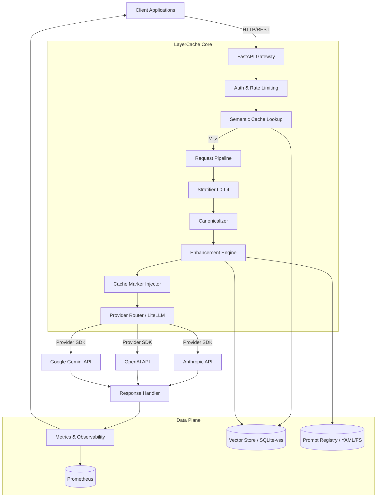

# Technical Design Document (TDD)
## Project: LayerCache
### Intelligent Prompt Enhancement & Token Caching Proxy

**Version:** 1.0 | **Status:** Draft | **Date:** October 2023

---

## 1. System Architecture Overview

LayerCache is implemented as an asynchronous Python proxy using FastAPI. It sits between client applications and LLM providers, acting as a middleware that transforms, caches, and routes requests.



---

## 2. Core Data Models

### 2.1 Internal Stratified Prompt Representation

To safely manipulate prompts without breaking semantics, we immediately parse standard OpenAI-format messages into our layered structure.

```python
from pydantic import BaseModel
from typing import Literal
from enum import Enum

class LayerType(str, Enum):
    SYSTEM = "L0_SYSTEM"
    CONTEXT = "L1_CONTEXT"
    SESSION = "L2_SESSION"
    ENHANCEMENT = "L3_ENHANCEMENT"
    USER = "L4_USER"

class StratifiedMessage(BaseModel):
    layer: LayerType
    role: str
    content: str | list[dict]  # Support for multimodal
    original_index: int        # For tracing back to client payload
    metadata: dict = {}        # e.g., tool definitions, cache_control

class StratifiedPrompt(BaseModel):
    layers: dict[LayerType, list[StratifiedMessage]] = {lt: [] for lt in LayerType}
    
    def reassemble(self) -> list[dict]:
        """Flattens layers back into standard OpenAI message format, L0 -> L4"""
        messages = []
        for layer_type in LayerType:
            for msg in self.layers[layer_type]:
                messages.append({"role": msg.role, "content": msg.content})
        return messages
```

### 2.2 Extended Request Payload

Clients can use standard OpenAI SDKs and pass LayerCache directives via the `extra_body` parameter.

```python
class LayerCacheRequest(BaseModel):
    # Standard OpenAI fields
    model: str
    messages: list[dict]
    temperature: float = 0.7
    
    # LayerCache Extensions (passed via extra_body in OpenAI SDK)
    lc_template: str | None = None          # e.g., "code-review-v2"
    lc_enhancements: list[str] = []         # e.g., ["chain_of_thought", "json_output"]
    lc_cache_ttl: int = 300                 # Semantic cache TTL in seconds
    lc_layer_hints: dict[str, str] | None = None # Explicit layer tagging by index
```

---

## 3. Component Deep Dives

### 3.1 Stratifier & Canonicalizer

**Responsibility:** Convert raw messages into `StratifiedPrompt` and normalize them for maximum prefix matching.

**Stratification Logic:**

1. If `lc_template` is used, fetch L0/L1 from the Prompt Registry. Ignore client L0/L1.
2. If `lc_layer_hints` is provided, use explicit mapping.
3. Default Heuristic:
    * `role=system` + no prior messages → L0
    * `role=system` + contains tool defs / long context → L1
    * `role=assistant` or `role=tool` → L2
    * `role=user` (final message) → L4
    * `role=user` (not final) → L2

**Canonicalization Rules:**

* **Tool Sorting:** Sort `tools` array alphabetically by `function.name`.
* **JSON Normalization:** Minify JSON strings in tool definitions (`separators=(',', ':')`).
* **Whitespace:** `strip()` all string content. Replace `\n\n\n` with `\n\n`.
* **Deterministic Ordering:** Within the same layer, sort messages by a deterministic hash of their content to ensure identical messages always appear in the same order.

### 3.2 Cache Marker Injector

**Responsibility:** Translate abstract L0-L4 boundaries into provider-specific API parameters.

```python
class AnthropicAdapter:
    def inject_markers(self, prompt: StratifiedPrompt, payload: dict) -> dict:
        messages = prompt.reassemble()
        marked_messages = []
        
        # Determine which layers are present and stable
        stable_layers = [LayerType.SYSTEM, LayerType.CONTEXT, LayerType.SESSION]
        last_stable_idx = -1
        
        for i, msg in enumerate(messages):
            if msg.layer in stable_layers:
                last_stable_idx = i
                
        for i, msg in enumerate(messages):
            msg_dict = {"role": msg.role, "content": msg.content}
            # Inject ephemeral cache control at the end of each stable block
            if i == last_stable_idx or \
               (i < last_stable_idx and messages[i+1].layer != msg.layer):
                msg_dict["cache_control"] = {"type": "ephemeral"}
            marked_messages.append(msg_dict)
            
        payload["messages"] = marked_messages
        return payload

class GeminiAdapter:
    def inject_markers(self, prompt: StratifiedPrompt, payload: dict) -> dict:
        # Gemini uses explicit CachedContent objects
        prefix_hash = hash(prompt.layers[LayerType.SYSTEM] + prompt.layers[LayerType.CONTEXT])
        cached_content = self.gemini_cache_manager.get_or_create(prefix_hash, prompt)
        
        payload["cached_content"] = cached_content.name
        # Remove L0/L1 from payload to avoid sending twice
        payload["contents"] = prompt.layers[LayerType.SESSION] + \
                              prompt.layers[LayerType.ENHANCEMENT] + \
                              prompt.layers[LayerType.USER]
        return payload
```

### 3.3 Enhancement Engine

**Responsibility:** Inject prompt engineering techniques *without* altering L0-L2.

Enhancements are defined as Python plugins implementing a common interface:

```python
class BaseEnhancement(ABC):
    name: str
    
    @abstractmethod
    def apply(self, prompt: StratifiedPrompt, **kwargs) -> StratifiedPrompt:
        """Must append to L3 (ENHANCEMENT) layer only."""
        pass

class ChainOfThoughtEnhancement(BaseEnhancement):
    name = "chain_of_thought"
    
    def apply(self, prompt: StratifiedPrompt, **kwargs) -> StratifiedPrompt:
        enh_msg = StratifiedMessage(
            layer=LayerType.ENHANCEMENT,
            role="user",
            content="Think step by step before answering."
        )
        prompt.layers[LayerType.ENHANCEMENT].insert(0, enh_msg)
        return prompt
```

### 3.4 Semantic Cache

**Responsibility:** Bypass the LLM entirely for semantically similar queries.

**Keying Strategy:**

We cannot just embed the whole prompt. If system instructions (L0) change but the query (L4) is the same, the answer is different.

* **Exact Match Key:** Hash of L0 + L1 + L2 content.
* **Semantic Search Key:** Embedding of L4 content.

**Implementation:**

```python
class SemanticCache:
    def __init__(self, db: Session, embedder: Embedder):
        self.db = db
        self.embedder = embedder

    async def lookup(self, prompt: StratifiedPrompt) -> dict | None:
        prefix_hash = self._hash_prefix(prompt)
        query_embedding = await self.embedder.embed(prompt.layers[LayerType.USER][-1].content)
        
        result = self.db.execute("""
            SELECT response, ttl_expires_at 
            FROM semantic_cache 
            WHERE prefix_hash = ? 
            AND vss_cosine_similarity(query_embedding, ?) > 0.95
            AND ttl_expires_at > CURRENT_TIMESTAMP
            ORDER BY vss_cosine_similarity DESC
            LIMIT 1
        """, (prefix_hash, query_embedding))
        
        return result.fetchone()
```

---

## 4. API Specification

The proxy exposes standard OpenAI-compatible endpoints, ensuring zero-friction adoption.

### `POST /v1/chat/completions`

Accepts standard OpenAI payload. Uses `extra_body` for LayerCache features.

**Request Example (Python OpenAI SDK):**

```python
from openai import OpenAI

client = OpenAI(
    base_url="http://layercache:8000/v1",
    api_key="your-actual-provider-key"
)

response = client.chat.completions.create(
    model="anthropic/claude-3-5-sonnet-20241022",
    messages=[
        {"role": "system", "content": "You are a helpful coding assistant."},
        {"role": "user", "content": "How do I reverse a list in Python?"}
    ],
    extra_body={
        "lc_enhancements": ["chain_of_thought"],
        "lc_cache_ttl": 600
    }
)
```

### `GET /v1/cache/metrics`

Returns cache performance data.

```json
{
  "provider_token_cache_hit_rate": 0.65,
  "semantic_cache_hit_rate": 0.12,
  "estimated_tokens_saved": 1450000,
  "estimated_cost_saved_usd": 14.50,
  "by_model": {
    "anthropic/claude-3-5-sonnet-20241022": {
      "provider_token_cache_hit_rate": 0.72
    }
  }
}
```

### `POST /v1/prompts/templates`

Manage the Prompt Registry dynamically.

---

## 5. Performance & Reliability

### 5.1 Latency Budget

The proxy must add minimal overhead to the request path when cache misses occur.

* **Target Overhead:** < 50ms (P95) on cache misses.
* **Semantic Cache Lookup:** < 20ms (local embedding + sqlite-vss).
* **Canonicalization & Injection:** < 5ms (pure CPU/in-memory).

### 5.2 Concurrency

* FastAPI runs via `uvicorn` with asynchronous I/O.
* Semantic cache embedding generation is CPU-bound. To avoid blocking the event loop, run the embedding model via a dedicated `ProcessPoolExecutor` or use an ONNX runtime with async bindings.
* LiteLLM (or underlying provider SDKs) handles HTTP connection pooling automatically.

### 5.3 Gemini CachedContext Lifecycle

Gemini's caching API requires creating a resource explicitly, which takes time.

* **Strategy:** The `GeminiAdapter` maintains a dictionary mapping `prefix_hash -> CachedContentName`.
* If a prefix hash is seen for the first time, the proxy makes a standard LLM call *and* asynchronously triggers the creation of the `CachedContent` in the background.
* Subsequent requests with the same hash will utilize the cached context. This prevents latency spikes on first requests.

---

## 6. Deployment & Configuration

### 6.1 Configuration (YAML)

```yaml
proxy:
  host: 0.0.0.0
  port: 8000
  auth:
    proxy_api_key: "proxy-secret"

providers:
  anthropic:
    api_key_env: ANTHROPIC_API_KEY
  openai:
    api_key_env: OPENAI_API_KEY
  gemini:
    api_key_env: GOOGLE_API_KEY

caching:
  semantic:
    enabled: true
    backend: sqlite
    db_path: /data/semantic_cache.db
    default_ttl: 300
    similarity_threshold: 0.95
    embedder: "BAAI/bge-small-en-v1.5"

enhancements:
  registered:
    - name: chain_of_thought
      class: layercache.enhancements.ChainOfThoughtEnhancement
```

### 6.2 Docker Deployment

```dockerfile
FROM python:3.11-slim
WORKDIR /app
COPY requirements.txt .
RUN pip install -r requirements.txt
RUN python -c "from fastembed import TextEmbedding; TextEmbedding('BAAI/bge-small-en-v1.5')"
COPY . /app
EXPOSE 8000
CMD ["uvicorn", "layercache.main:app", "--host", "0.0.0.0", "--port", "8000"]
```

---

## 7. Future Considerations (Post-V1)

* **Streaming Support:** Semantic caching is straightforward with streaming, but calculating token savings from provider prefix caching (Anthropic) requires parsing the `StreamEvent` `usage` blocks, which arrive at the end of the stream. Metrics aggregation must handle delayed reporting.
* **Multi-Modal Caching:** Extending the Semantic Cache to hash image inputs (using CLIP embeddings) for GPT-4V/Claude 3.5 Sonnet vision tasks.
* **Distributed Mode:** Using Redis instead of SQLite for the Semantic Cache and Prometheus metrics to allow horizontal scaling of the LayerCache proxy behind a load balancer.
